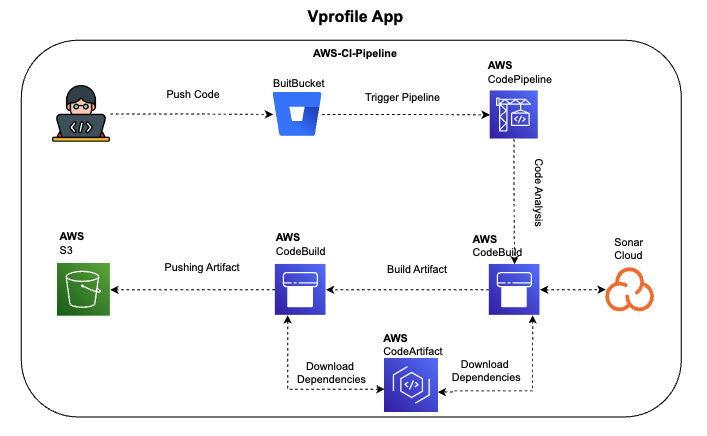

#Vprofile App – CI/CD Pipeline

This repository contains the source code and Continuous Integration (CI) and Continuous Deployment (CD) configuration for the Vprofile App.
The pipeline automates code analysis, artifact creation, publication, and now deployment, leveraging AWS services for secure, repeatable delivery.

---

##  Architecture Overview

 <!-- Replace with actual image path if different -->

According to the diagram above, the flow is as follows:

1. **Push Code** – Developer pushes changes to Bitbucket.

2. **AWS CodePipeline** – Triggers on every change and orchestrates the workflow.

3. **Code Analysis**  
   - CodeBuild downloads dependencies from AWS CodeArtifact  
   - Runs unit tests, Checkstyle, SonarCloud analysis  
   - Stops the pipeline if SonarCloud quality gate fails  

4. **Build Artifact**  
   - CodeBuild compiles and packages the app  
   - Pushes the `.war` artifact to AWS S3  

5. **Software Testing (Dev Environment)**  
   - Artifact is deployed to AWS Elastic Beanstalk (Dev)  
   - Automated or manual tests can be run  

6. **Deploy to Production**  
   - After validation, the same artifact is promoted and deployed to AWS Elastic Beanstalk (Prod)
All Maven dependencies are served securely from AWS CodeArtifact to ensure a reproducible build.

---

## Prerequisites

| Requirement | Notes |
|-------------|-------|
| **AWS Account** | IAM permissions for CodePipeline, CodeBuild, S3, CodeArtifact |
| **SonarCloud Account** | To replicate quality‑gate integration |
| **Java 17** | Local development & build |
| **Maven knowledge** | Understanding of `settings.xml`, profiles, etc. |

---

## Technologies Used

| Purpose                      | Service / Tool          |
|------------------------------|-------------------------|
| CI/CD Orchestration          | **AWS CodePipeline**    |
| Build & Analysis             | **AWS CodeBuild**       |
| Artifact Storage             | **AWS S3**              |
| Dependency Management        | **AWS CodeArtifact**    |
| Static Code Analysis         | **SonarCloud**, **Checkstyle** |
| Build Automation             | **Apache Maven**        |
| Runtime                      | **Java (Corretto 17)**  |
| JSON Processing              | **jq**                  |
# Prerequisites
#
- JDK 11 
- Maven 3 
- MySQL 8

