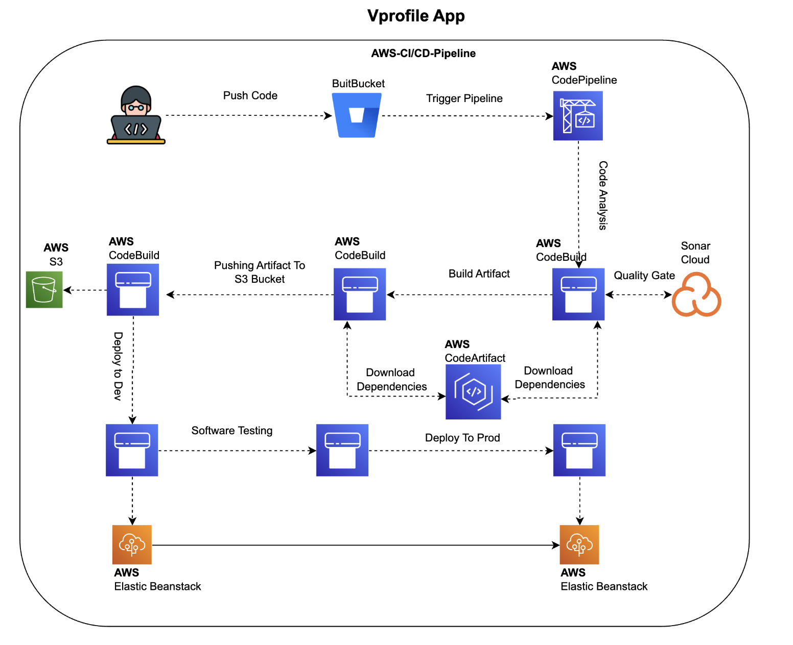

# Vprofile App – CI/CD Pipeline

This repository contains the source code and **Continuous Integration (CI)** configuration for the **Vprofile App**.  
The pipeline automates code analysis, artifact creation and publication, leveraging AWS services for secure, repeatable delivery.

---

## 🏗️ Architecture Overview

 <!-- Replace with actual image path if different -->

The diagram above illustrates the high‑level flow:

  **Code Push** – a developer pushes commits to the source repository.  
  **AWS CodePipeline** orchestrates the workflow and fans out to two CodeBuild stages.  
  **Code Analysis (CodeBuild #1)** – runs unit tests, Checkstyle and SonarCloud analysis.  
  **Build Artifact (CodeBuild #2)** – compiles the application and packages a deployable artifact.  
  **AWS CodeArtifact** – both builds download Maven dependencies from a private repository.  
  **S3 Artifact Storage** – the final `.war` file is uploaded for downstream deployment.  

---

## 🛠️ CI/CD Pipeline Stages

### 1️⃣ Code Analysis Stage

Runs unit tests and static analysis (Checkstyle + SonarCloud).

<details>
<summary>buildspec.yml (analysis)</summary>

```yaml
version: 0.2
env:
  parameter-store:
    LOGIN: LOGIN                # SonarCloud login token
    HOST: HOST                  # SonarCloud host URL
    Organization: Organization  # SonarCloud organization key
    Project: Project            # SonarCloud project key

phases:
  install:
    runtime-versions:
      java: corretto17
    commands:
      - cp ./settings.xml /root/.m2/settings.xml
      - export CODEARTIFACT_AUTH_TOKEN=`aws codeartifact get-authorization-token           --domain vprofile-repo-manager           --domain-owner 441160708640           --region us-east-1           --query authorizationToken --output text`
  pre_build:
    commands:
      - apt-get update && apt-get install -y jq checkstyle
      - wget https://repo.maven.apache.org/maven2/org/apache/maven/apache-maven/3.9.4/apache-maven-3.9.4-bin.tar.gz
      - tar xzvf apache-maven-3.9.4-bin.tar.gz && ln -s apache-maven-3.9.4 maven
      - wget https://binaries.sonarsource.com/Distribution/sonar-scanner-cli/sonar-scanner-cli-3.3.0.1492-linux.zip
      - unzip sonar-scanner-cli-3.3.0.1492-linux.zip
      - export PATH=$PATH:/sonar-scanner-3.3.0.1492-linux/bin/
  build:
    commands:
      - mvn test
      - mvn checkstyle:checkstyle
      - mvn sonar:sonar           -Dsonar.login=$LOGIN           -Dsonar.host.url=$HOST           -Dsonar.projectKey=$Project           -Dsonar.organization=$Organization           -Dsonar.java.binaries=target/test-classes/com/visualpathit/account/controllerTest/           -Dsonar.junit.reportsPath=target/surefire-reports/           -Dsonar.jacoco.reportsPath=target/jacoco.exec           -Dsonar.java.checkstyle.reportPaths=target/checkstyle-result.xml
      - sleep 5
      - curl https://sonarcloud.io/api/qualitygates/project_status?projectKey=$Project > result.json
      - cat result.json
      - |
        if [ $(jq -r '.projectStatus.status' result.json) = ERROR ]; then
          echo "Quality gate failed"; exit 1
        fi
```
</details>

**Highlights**

* **Java 17** runtime (Corretto).  
* Private dependency resolution via **AWS CodeArtifact**.  
* Static checks: **Checkstyle** and **SonarCloud**.  
* Build fails automatically if SonarCloud quality gate = `ERROR`.  

---

### 2️⃣ Build Artifact Stage

Compiles and packages the application after analysis has passed.

<details>
<summary>buildspec.yml (artifact)</summary>

```yaml
version: 0.2
phases:
  install:
    runtime-versions:
      java: corretto17
    commands:
      - cp ./settings.xml /root/.m2/settings.xml
      - export CODEARTIFACT_AUTH_TOKEN=`aws codeartifact get-authorization-token           --domain vprofile-repo-manager           --domain-owner 441160708640           --region us-east-1           --query authorizationToken --output text`
  pre_build:
    commands:
      - apt-get update && apt-get install -y jq
      - wget https://repo.maven.apache.org/maven2/org/apache/maven/apache-maven/3.9.4/apache-maven-3.9.4-bin.tar.gz
      - tar xzvf apache-maven-3.9.4-bin.tar.gz && ln -s apache-maven-3.9.4 maven
  build:
    commands:
      - mvn clean install -DskipTests
artifacts:
  files:
    - target/**/*.war
  discard-paths: yes
```
</details>

**Highlights**

* Skips tests (already executed in analysis stage).  
* Generates `target/vprofile.war`.  
* CodePipeline uploads the artifact to an **S3 bucket**.  

---

## 🔑 Prerequisites

| Requirement | Notes |
|-------------|-------|
| **AWS Account** | IAM permissions for CodePipeline, CodeBuild, S3, CodeArtifact |
| **AWS CLI** | Configured with appropriate credentials |
| **SonarCloud Account** | To replicate quality‑gate integration |
| **Java 17** | Local development & build |
| **Maven knowledge** | Understanding of `settings.xml`, profiles, etc. |

---

## ⚙️ Technologies Used

| Purpose                      | Service / Tool          |
|------------------------------|-------------------------|
| CI/CD Orchestration          | **AWS CodePipeline**    |
| Build & Analysis             | **AWS CodeBuild**       |
| Artifact Storage             | **AWS S3**              |
| Dependency Management        | **AWS CodeArtifact**    |
| Static Code Analysis         | **SonarCloud**, **Checkstyle** |
| Build Automation             | **Apache Maven**        |
| Runtime                      | **Java (Corretto 17)**  |
| JSON Processing              | **jq**                  |

---

## 📄 License

This project is licensed under the MIT License – see `LICENSE` for details.
